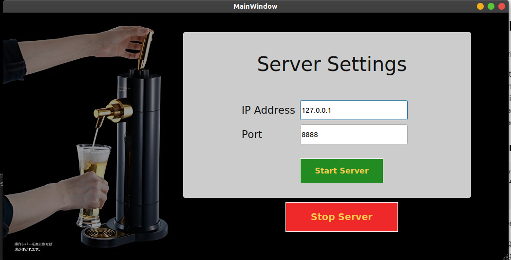
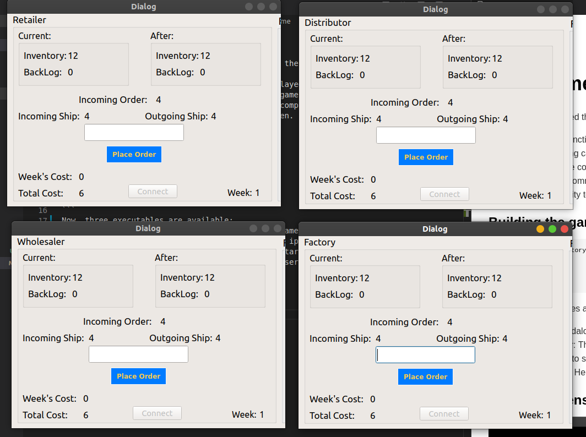

##### se-03-team-24
# Beer Game

In this sprint, we added these main features in the repository that we received:
* Created a fully functional game that can be played locally.
* Added networking capabilities such that the game can be hosted on a server and players can play in LAN in multiple computers. 
* Added relevant comments in the code for doxygen.
* Added functionality tests for the game.
* Updated code organization

### Building the game
```
cd {to-project-directory}
mkdir build
cd build
cmake ..
make
```
Now, three executables are available:
* beergame : Standalone executable to play the game in a single computer
* beergame-server: This provides selection of an ip-address and a port, such that clients can run *beergame-client* to start the game.
* beergame-client: Helps to connect to beergame-server to play the game.

### How to play the game:
#### Locally:
* Run *beergame*
* Click **Play as guest Instructor**
* Specify settings
* Click Start game
* Now windows for all four players will apper

#### In a LAN:
* Run *beergame-server*
* Enter an ip and port that are available in the lan.
* Start *beergame-client* from client computers. Enter the ip-address and port on which the server is running.
* Then you will be prompted to enter the game and role. As of now, only one game can be played in a LAN. So enter '1'.
* For role each player can chose from {1,2,3,4}. Duplications will make the game invalid.
* After all players have conencted, the game will start automatically.

### Sample screenshots of the game

#### Server:

#### Client:


[@1be6-ankit](https://github.com/1be6-ankit)
[@AYUSH477](https://github.com/AYUSH477)
